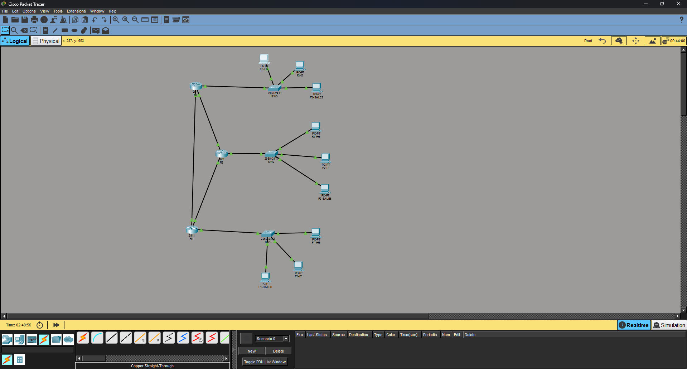

# OSPF + VLAN Routed Network Lab (Cisco Packet Tracer)

A small routed network lab built in Cisco Packet Tracer, demonstrating:
- A 3-router triangle topology running **single-area OSPF**
- **Router-on-a-stick** VLAN routing (HR, IT, Sales departments per site)
- Stable router identity via **loopback interfaces** matching **manually configured router IDs**
- Efficient point-to-point addressing using **/30 subnets**
- Clean OSPF interface hygiene using **`passive-interface default`**

## Topology



Three Cisco 2911 routers (R1, R2, R3) are fully meshed with point-to-point links, each connected to a Cisco 2960-24TT switch (SW1, SW2, SW3) that provides access-layer connectivity for three VLANs per site: **HR**, **IT**, and **Sales**.

## Design Overview

### Router IDs & Loopbacks
Each router has a `/32` loopback address that matches its manually configured OSPF router ID (e.g. R1 → `1.1.1.1`). This avoids router-ID instability that could occur if it were derived from a physical interface that might go down.

### Point-to-Point Links
Each inter-router link uses a `/30` subnet — the smallest block that provides exactly the two usable addresses needed for a two-router link, avoiding wasted address space.

### VLAN Routing (Router-on-a-Stick)
Each router has one physical interface trunked to its local switch, split into sub-interfaces (one per VLAN) using `encapsulation dot1Q`. Each VLAN gets its own IP subnet **per site** — VLAN 10 ("HR") is a different subnet on R1, R2, and R3 — because overlapping subnets cannot be routed between without NAT or VRF. See [`addressing-table.md`](addressing-table.md) for the full breakdown.

### OSPF
All three routers run OSPF process 1, in a single backbone area (Area 0). Interface participation follows a "secure by default" pattern:
```
passive-interface default
no passive-interface <interface facing another router>
```
This means every OSPF-enabled interface starts passive (no Hellos sent) unless explicitly excluded — so only genuine router-to-router links form adjacencies, while LAN-facing VLAN sub-interfaces and loopbacks stay passive (their subnets are still advertised, just without sending unnecessary Hellos toward end hosts).

## Repository Contents

```
ospf-vlan-lab/
├── README.md                  → this file
├── addressing-table.md        → full IP/VLAN/subnet plan
├── topology/
│   └── topology.png           → Packet Tracer topology screenshot
└── configs/
    ├── R1.txt                 → R1 running-config
    ├── R2.txt                 → R2 running-config
    ├── R3.txt                 → R3 running-config
    ├── SW1.txt                → SW1 running-config
    ├── SW2.txt                → SW2 running-config
    └── SW3.txt                → SW3 running-config
```

## Verification Commands Used

```
show ip ospf neighbor        → confirm FULL adjacencies between R1-R2, R2-R3, R1-R3
show ip route ospf           → confirm all VLAN subnets are learned network-wide
show ip ospf interface brief → confirm passive vs active interface state
show vlan brief               → confirm VLAN/port assignments on each switch
```

End-to-end connectivity was verified with `ping` between PCs in the same department (e.g. HR) across different sites, confirming OSPF correctly routes between the per-site VLAN subnets.

## Possible Extensions
- Add authentication (MD5) to OSPF adjacencies
- Summarize each site's three VLAN subnets into a single OSPF route (route summarization)
- Add a 4th site connected via a WAN link to test multi-area OSPF (ABR design)
- Replace router-on-a-stick with an L3 switch (SVIs) for comparison

---
